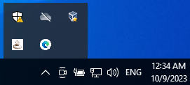

# Break Reminder App

Are you tired of long work hours, constantly glued to your computer screen, and forgetting to take breaks? Introducing the Break Reminder App, your ultimate companion for a healthier and more productive work routine!

## Features

- Provides a system tray icon with a menu for easy interaction.
- Allows you to customize the break interval in minutes.
- Plays an audio reminder when it's time to take a break.
- Sends periodic notifications to remind you to step away from your computer.

# Why Should You Use This Program?
1. Boost Your Productivity
The Break Reminder App is designed to enhance your productivity by reminding you to take short, refreshing breaks at optimal intervals. Research shows that regular breaks can improve focus and creativity, making you more efficient in your tasks.

2. Prioritize Your Health
Your well-being matters. Prolonged periods of sitting and staring at a screen can lead to health issues. Our app encourages you to step away from your desk, stretch, and relax, reducing the risks associated with sedentary work habits. It also helps protect your precious eyesight by preventing extended screen exposure, which can lead to blurry vision.

3. Customizable Experience
Unlike other alternatives, our app allows you to personalize your break intervals and even choose your favorite reminder sound. Tailor the app to your preferences and make it an integral part of your daily routine.

4. Unobtrusive Design
The Break Reminder App operates discreetly in your system tray. It won't disrupt your workflow or clutter your desktop. You'll receive gentle reminders, ensuring you stay on top of your work without feeling overwhelmed. This simple program has no distracting features, keeping your focus where it matters—on your tasks.

# Why Not Use an Alternative?
While there are alternative break reminder tools available, the Break Reminder App offers unique advantages:

- Simplicity
Our app is straightforward and easy to use, making it accessible to everyone, regardless of technical expertise. It's a minimalist solution that won't add unnecessary complexity to your workday.

- Flexibility
Unlike some alternatives, we provide flexibility in choosing your break intervals. You can set the duration that suits your work style best.

- Audio Reminders
We offer audio reminders, which can be more engaging and effective than visual-only reminders provided by some alternatives.

## Requirements

For windows users only.

Before using this application, make sure you have the following dependencies installed:

- Python 3.x
- `pystray` library
- `playsound` library

You can install the required libraries using `pip`:

```bash
pip install pystray playsound
python Break.py
```

# Demo

Double click on the bat file, and there will be a coffee icon in the system tray notification :

